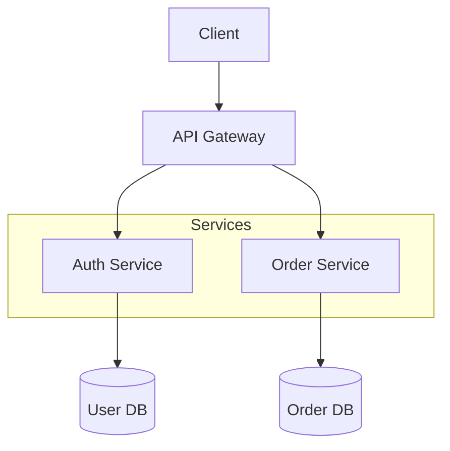
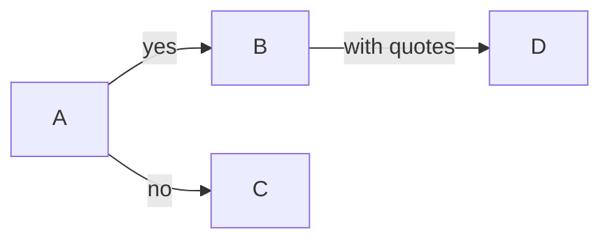
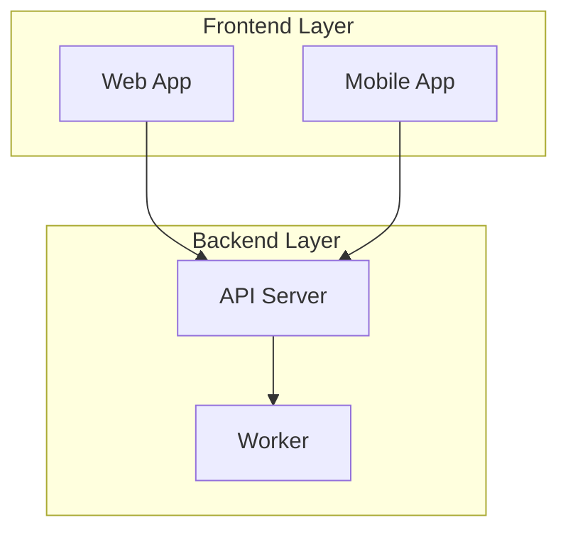
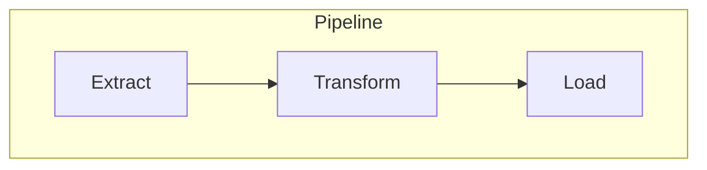
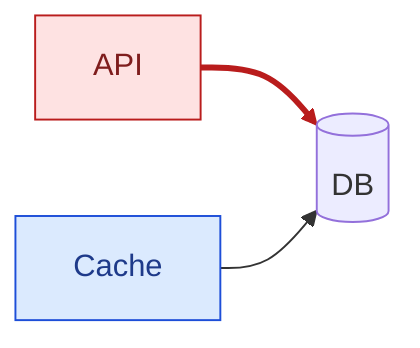
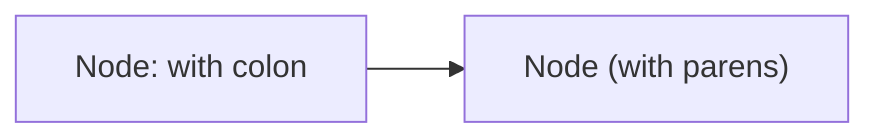

# Flowchart Syntax

## Basic Structure

## Direction

| Keyword | Direction |
|---------|-----------|
| `TD` / `TB` | Top to bottom |
| `LR` | Left to right |
| `RL` | Right to left |
| `BT` | Bottom to top |

## Node Shapes

| Syntax | Shape | Use for |
|--------|-------|---------|
| `[text]` | Rectangle | Default nodes |
| `(text)` | Rounded rectangle | Processes |
| `{text}` | Diamond | Decisions |
| `[(text)]` | Cylinder | Databases |
| `[[text]]` | Subroutine | External calls |
| `((text))` | Circle | Start/end points |
| `>text]` | Flag | Async events |
| `{{text}}` | Hexagon | Preparation steps |

## Arrow Types

| Syntax | Style | Use for |
|--------|-------|---------|
| `-->` | Arrow | Normal flow |
| `---` | Line | Connection (no direction) |
| `-.->` | Dashed arrow | Optional/async |
| `==>` | Thick arrow | Important flow |
| `--x` | X end | Termination |
| `--o` | Circle end | Reference |

## Labels on Arrows

## Subgraphs

## Direction Inside a Subgraph

## Styling

- `classDef name fill:…,stroke:…,color:…` defines a class; attach with `:::name` inline or `class A,B name`.
- `style A fill:#bbf` styles a single node without a class.
- `linkStyle N …` styles the Nth edge, counted in declaration order.

## Special Characters

Wrap in quotes for special characters:

## Comments

`%%` starts a comment line (must be its own line).
