# Other Diagram Types

## State Diagram

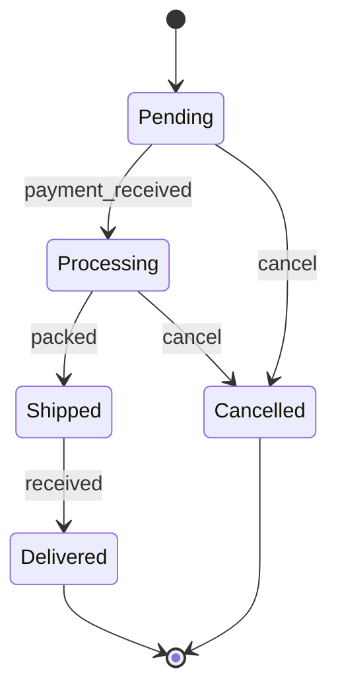

### Composite States

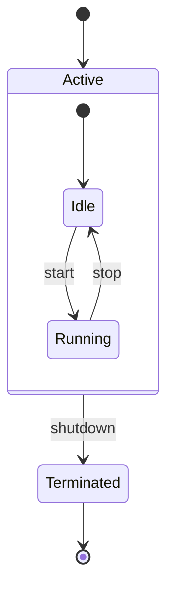

### Choice

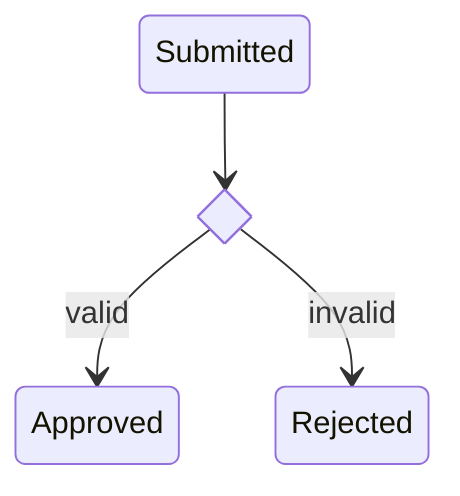

---

## Git Graph

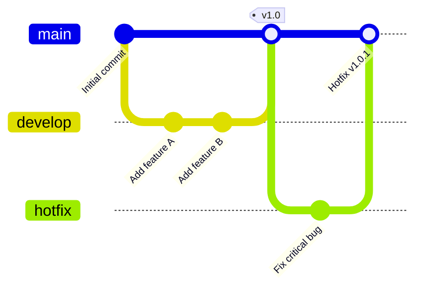

---

## Gantt Chart

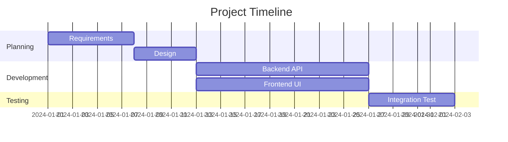

---

## Pie Chart

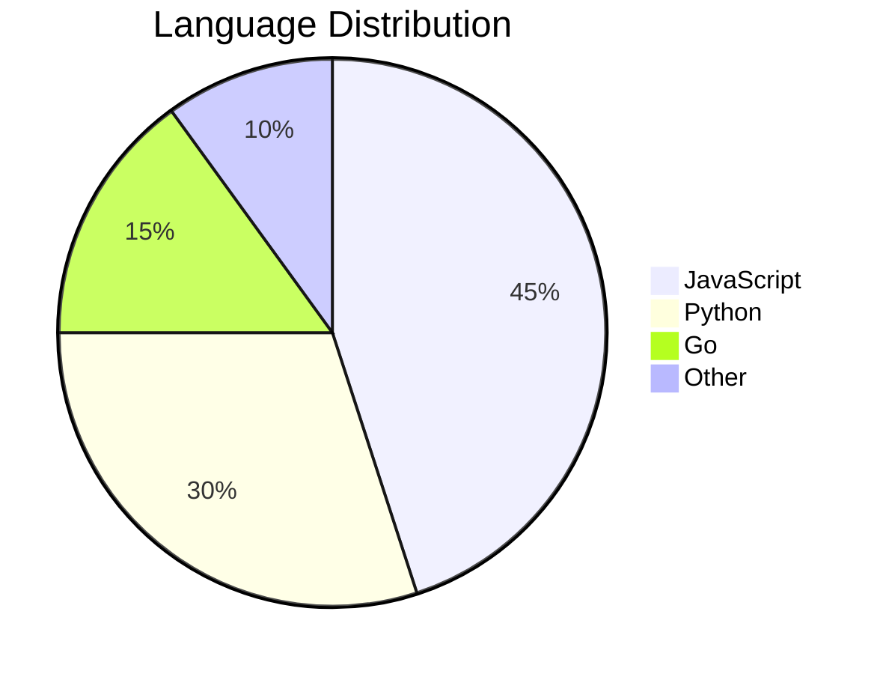

---

## Mind Map

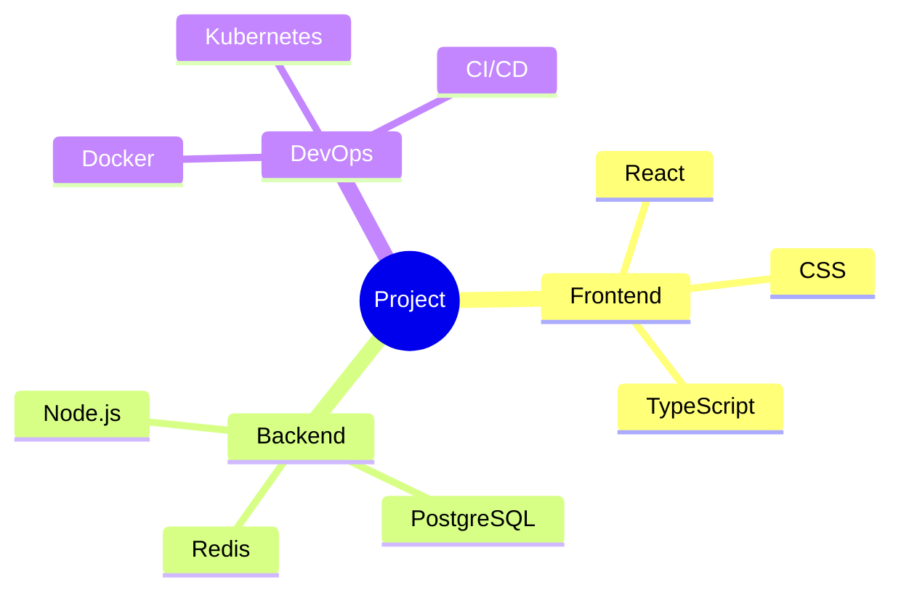

---

## Timeline

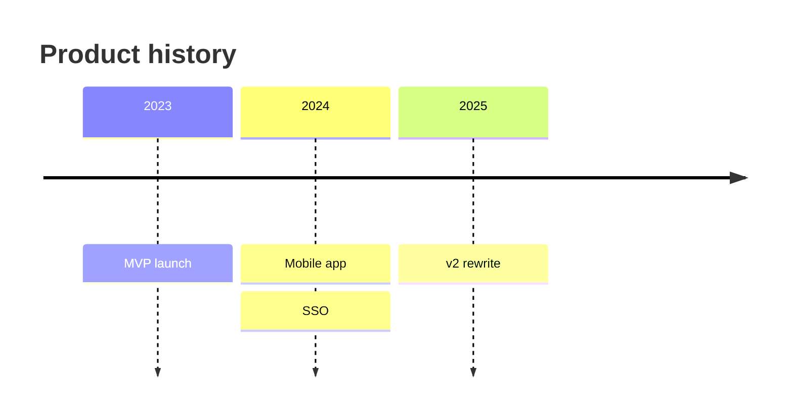

---

## User Journey

Scores are 1–5 satisfaction, per actor:

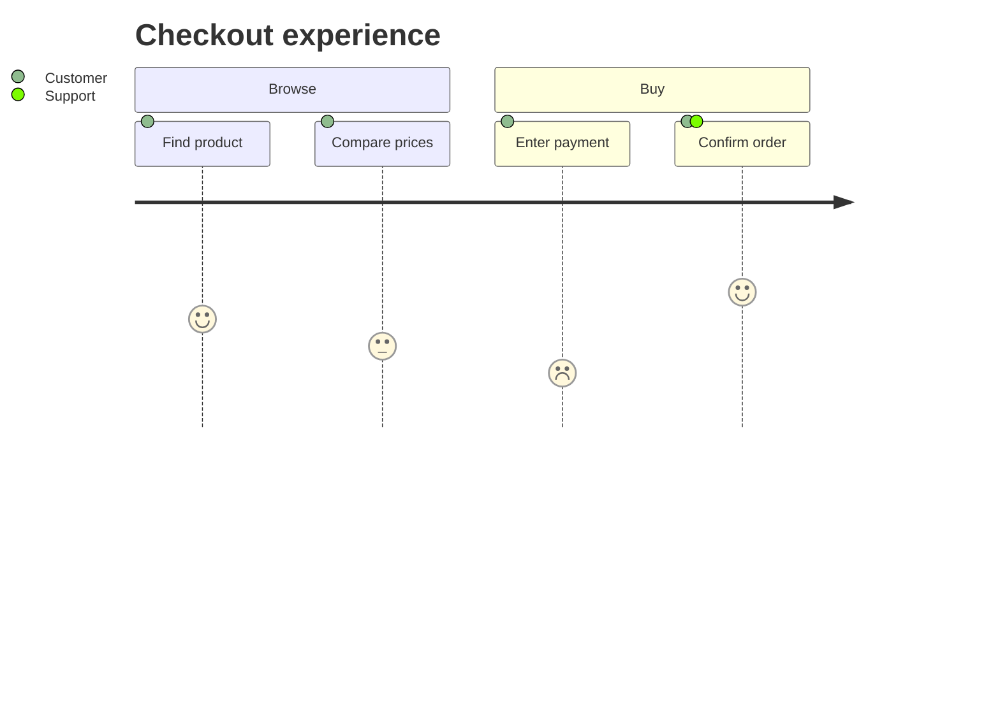

---

## Quadrant Chart

Quadrants number counter-clockwise from top-right; points are `[x, y]` in 0–1:

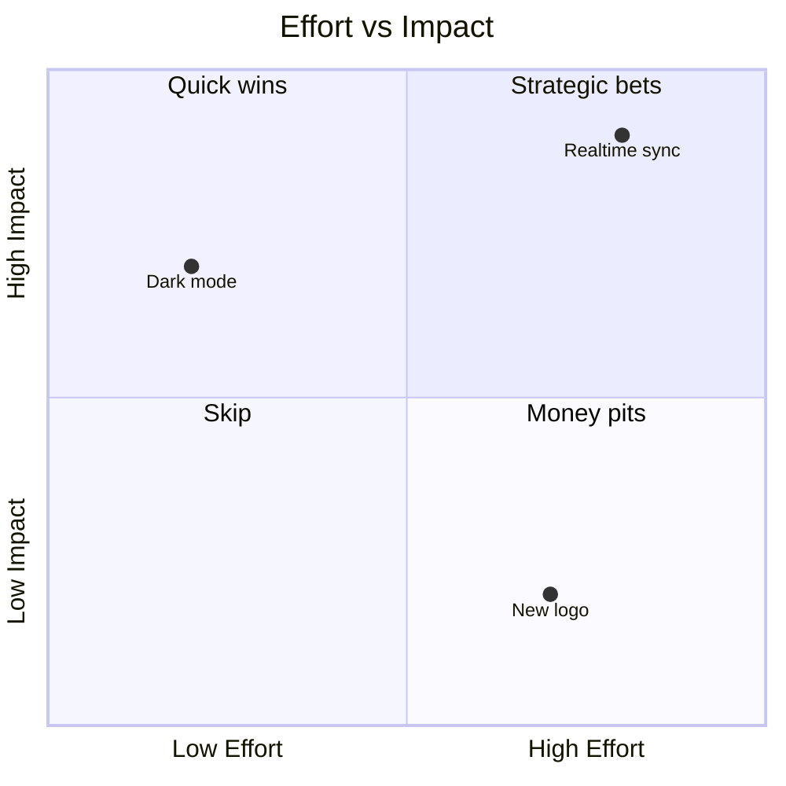

---

## XY Chart

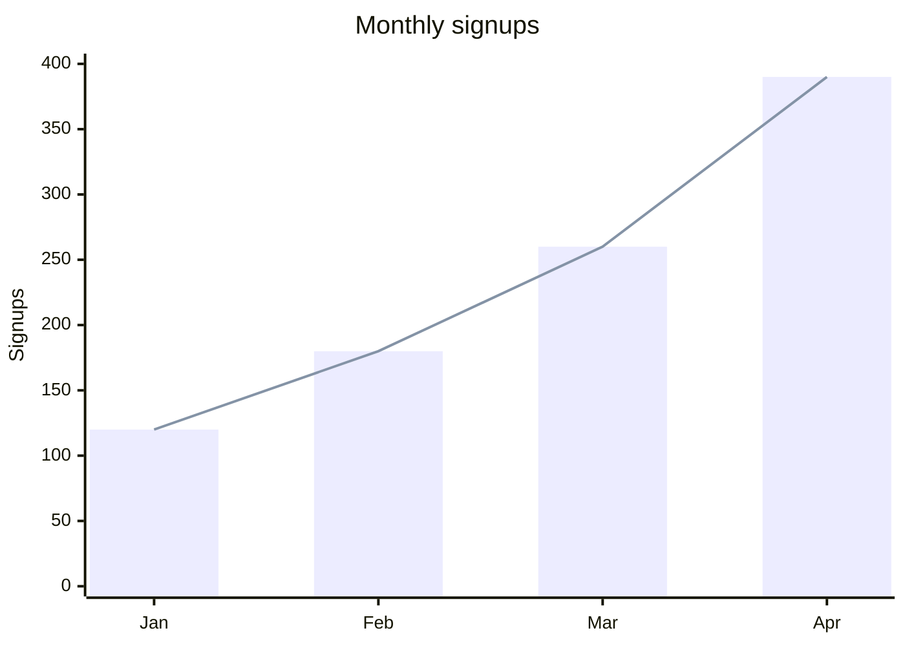

---

## C4 Context Diagram

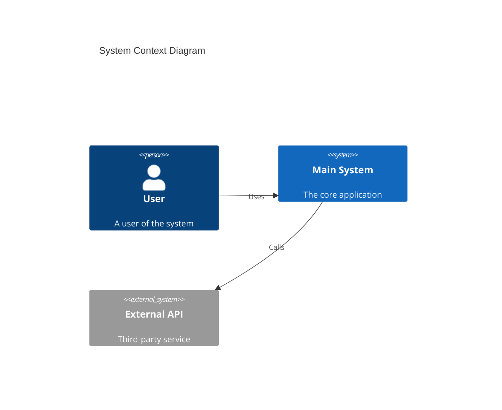
